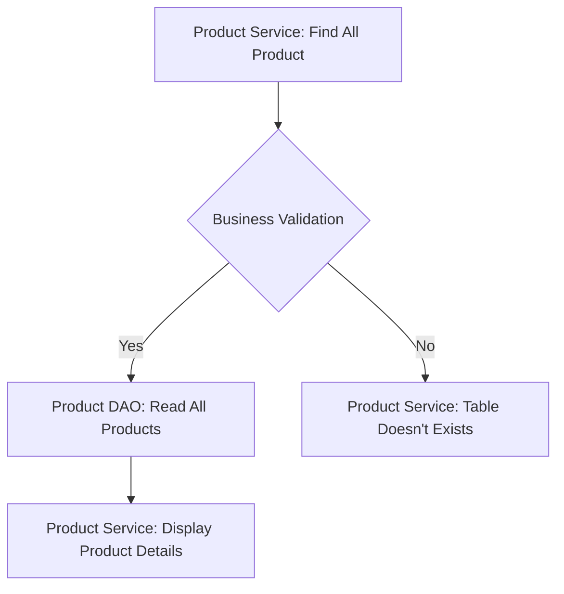
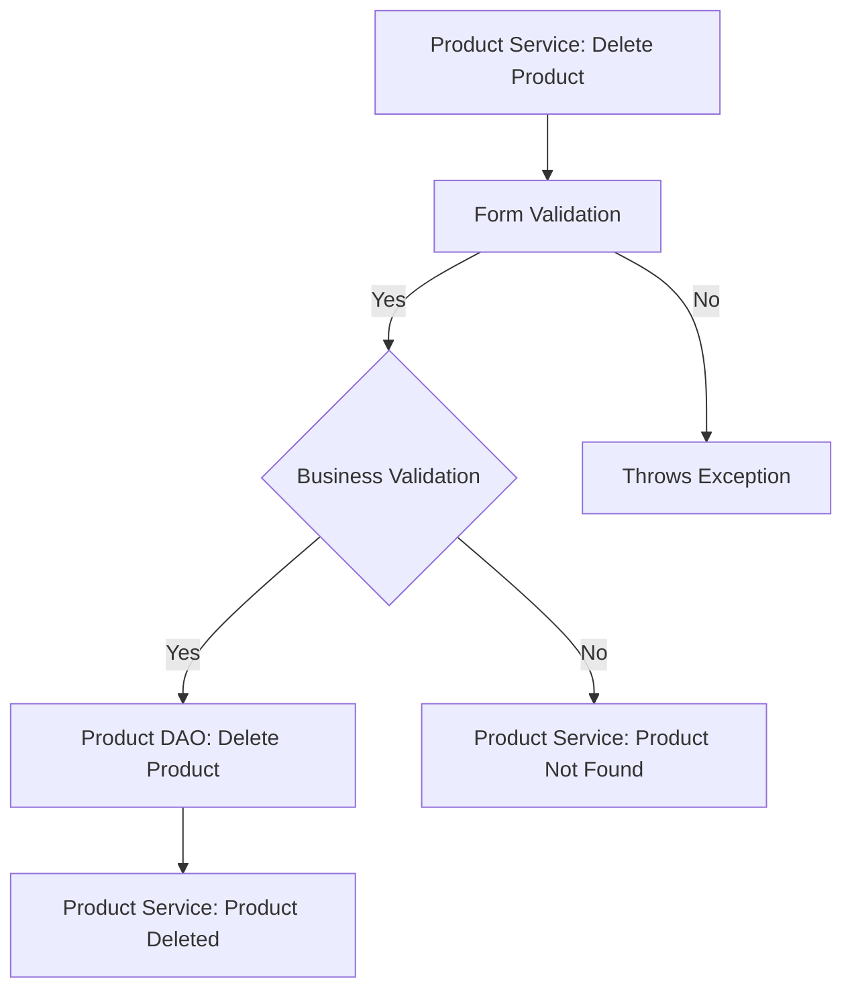
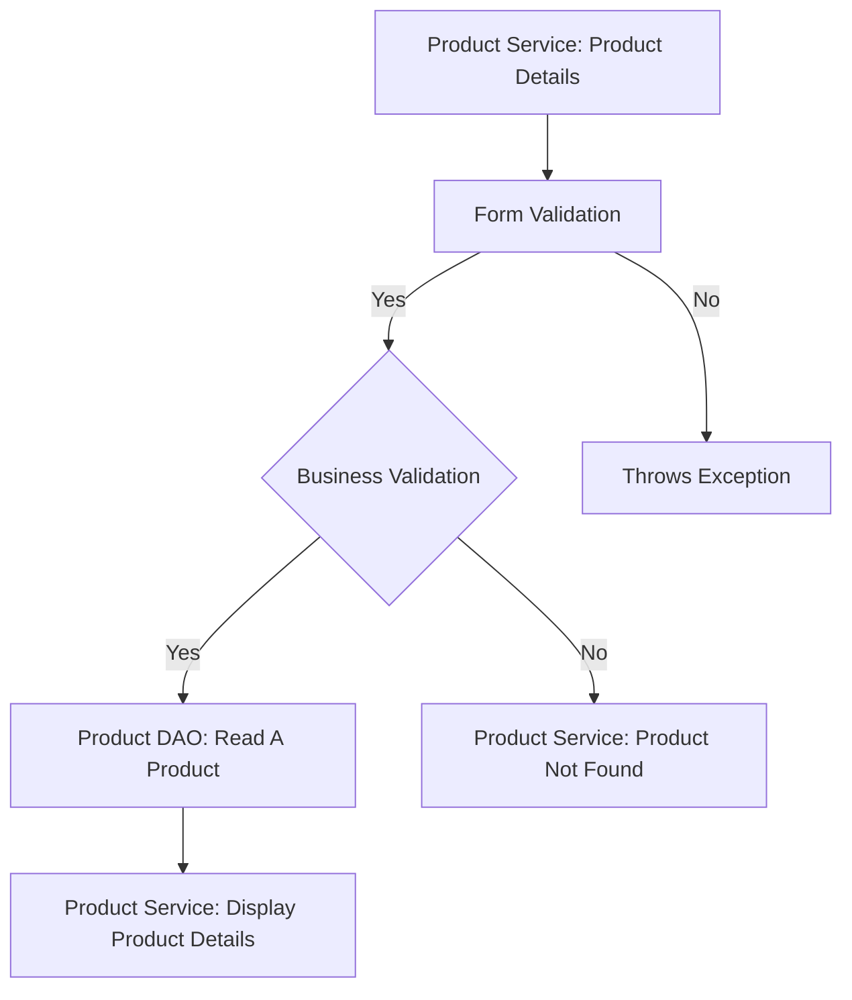
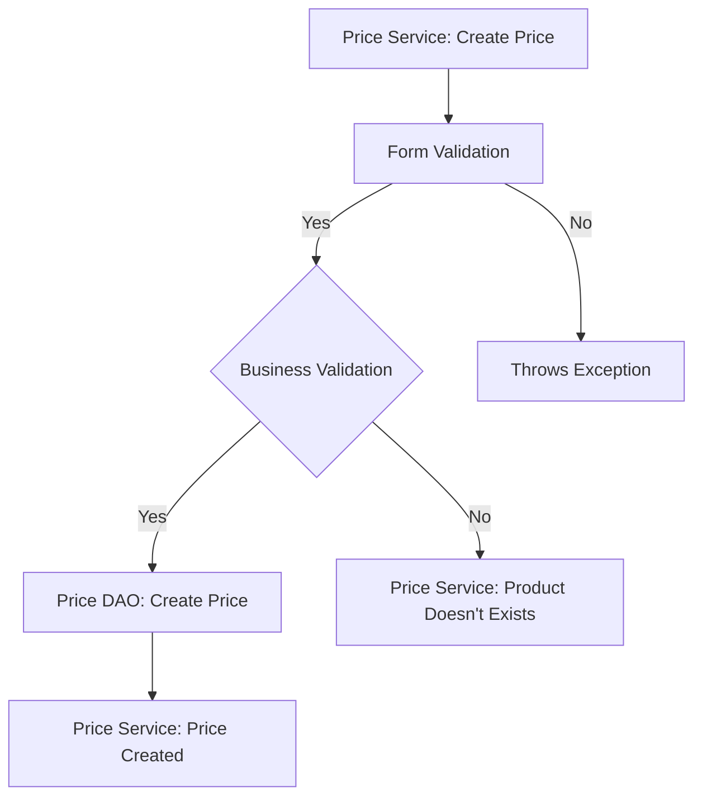
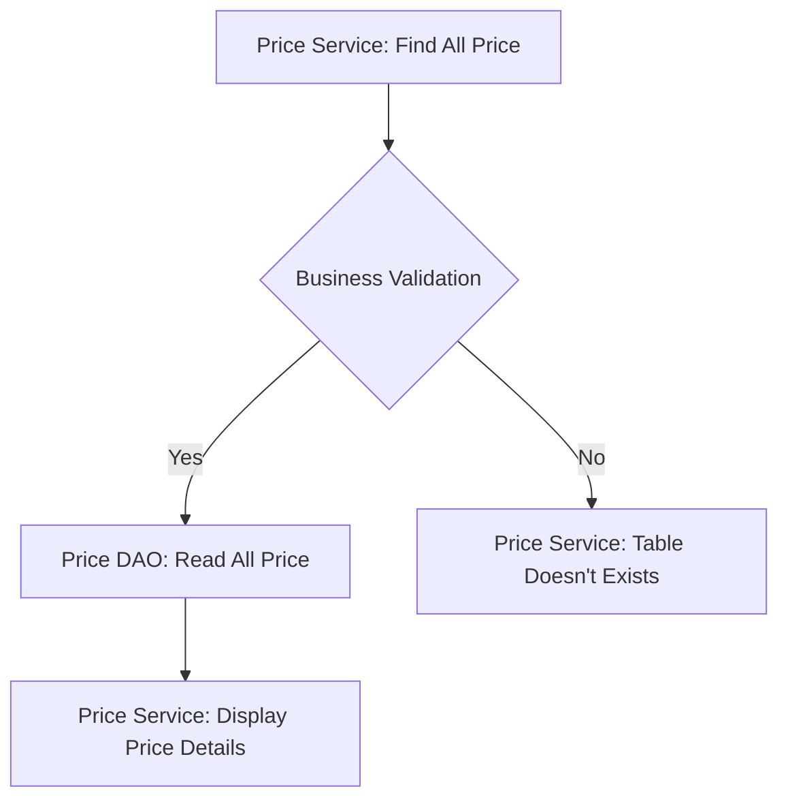

# M A M Billing  Checklist

 #### [Milestones](https://github.com/fssa-batch3/sec_b_maruthan.alagar__corejava_project_2/milestones)

## Database Design

- [ ] Create an ER diagram of the database

- [ ] Write Create table scripts [script](/src/main/resources/db/migration/V1__create_products.sql)

## Project Setup

- [ ] Create a new Java project
- [ ] Set up a MySQL database
- [ ] Add necessary libraries
	- [ ] JDBC, 
	- [ ] MySQL Connector, 
	- [ ] JUnit, 
	- [ ] Dotenv

## Module: Product (Milestone 1)

### Feature 1: Product Creation 
#### User Story:
 User can create new product.
#### Prerequisites:
- [ ] Create Product table
- [ ] Implement Product model
- [ ] Implement Product DAO (create)
- [ ] Complete Price Module Feature 1.
#### Validations:

##### Form Validation:
- [ ] Product Name (Null , Pattern & Length)
- [ ] Quantity (Quantity <= 0)
- [ ] Quantity Type (ENUM - mg , ml , Nos)
- [ ] Special Name (Null , Pattern & Length) **(Optional)**
#####   Business Validation:
- [ ] Check The product is already exists or not using Name and Quantity.
#### Messages: 
 -  Name Cannot be Null or Empty.
 -  Quantity cannot be less than or equal to 0.
 -  Choose any Quantity Type.
 - Special Name Cannot be Null or Empty. 

#### Flow: 

### Feature 2 : List All Product
#### User Story:
 User can view the product list.
#### Prerequisites:
- [ ] Complete Product Module Feature 1.
- [ ] Implement Product DAO (Find All)

#### Validations:
#####   Business Validation:
- [ ] Check the Product table is already exists or not.
#### Messages: 
 -  Product Table Not Found.

#### Flow: 

### Feature 3 : Update Product Details
#### User Story:
 User can update product detail.
#### Prerequisites:
- [ ] Complete Product Module Feature 1.
- [ ] Implement Product DAO (Update)

#### Validations:

##### Form Validation:

- [ ]  Product Name (Null , Pattern & Length)
- [ ] Product ID ( ID <= 0)
- [ ] Quantity ( Quantity <= 0)
- [ ] Quantity Type (ENUM - mg , ml , Nos)
- [ ] Special Name (Null , Pattern & Length)
#####   Business Validation:
- [ ] Check The product is exists or not.
#### Messages: 
 -  Product is Not Found
 - Product ID cannot be less than or equal to 0
 -  Name cannot be Null or Empty.
 -  Quantity cannot be less than or equal to 0.
 -  Choose any Quantity Type.
 -  Special Name cannot be Null or Empty.

#### Flow: 

### Feature: Delete Product Details
#### User Story:
User can delete a product.
#### Prerequisites:
- [ ] Complete Product Module Feature 1.
- [ ] Implement Product DAO (Delete)

#### Validations:

##### Form Validation:

- [ ] Product ID ( ID <= 0)
#####   Business Validation:
- [ ] Check The product is exists or not.
#### Messages: 
 -  Product Not Found
 -  Product ID cannot be less than or equal to 0

#### Flow: 

### Feature 5 : Product Details
#### User Story:
 User can view the single product details.
#### Prerequisites:
- [ ] Complete Product Module Feature 1.
- [ ] Implement Product DAO (Find By ID)

#### Validations:

##### Form Validation:

- [ ] Product ID ( ID <= 0)
#####   Business Validation:
- [ ] Check The product is exists or not.
#### Messages: 
 -  Product Not Found
 -  Product ID cannot be less than or equal to 0

#### Flow: 

## Module 2 : Price (Milestone 1)
### Feature 1: Price Creation 
#### User Story:
 User can create new Price.
#### Prerequisites:
- [ ] Create Price table
- [ ] Implement Price model
- [ ] Implement Price DAO (create)

#### Validations:

##### Form Validation:

- [ ] MRP (MRP <= 0)
- [ ] Tax (Tax <= 0 and Tax > 100)
- [ ]  Discount (Discount <= 0 and Discount > 100)

#####   Business Validation:
- [ ] Check the Price table is exists or not.
#### Messages: 
 -  MRP cannot be less than or equal to 0.
 -  Tax cannot be less than or equal to 0.
 -  Discount cannot be less than or equal to 0.
 -  Tax cannot be greater than 100.
 -  Discount cannot be greater than 100.

#### Flow: 

### Feature 2 : List All Price
#### User Story:
 User can view the Price list.
#### Prerequisites:
- [ ] Complete Price Module Feature 1.
- [ ] Implement Price DAO (Find All)
#### Validations:
#####   Business Validation:
- [ ] Check the Price table is already exists or not.
#### Messages: 
 -  Price Table Not Found.

#### Flow: 

### Feature 3 : Update Price Details
#### User Story:
 User can update Price.
#### Prerequisites:
- [ ] Complete Price Module Feature 1.
- [ ] Implement Price DAO (Update)

#### Validations:

##### Form Validation:

- [ ] Price ID (ID<= 0)
- [ ] MRP (MRP <= 0)
- [ ] Tax (Tax <= 0 and Tax > 100)
- [ ] Discount (Discount <= 0 and Discount > 100)

#####   Business Validation:
- [ ] Check The Price Detail is exists.
#### Messages: 
 -  Price ID is Invalid.
 -  MRP cannot be less than or equal to 0.
 -  Tax cannot be less than or equal to 0.
 -  Discount cannot be less than or equal to 0.
 -  Tax cannot be greater than 100.
 -  Discount cannot be greater than 100.

#### Flow: 

