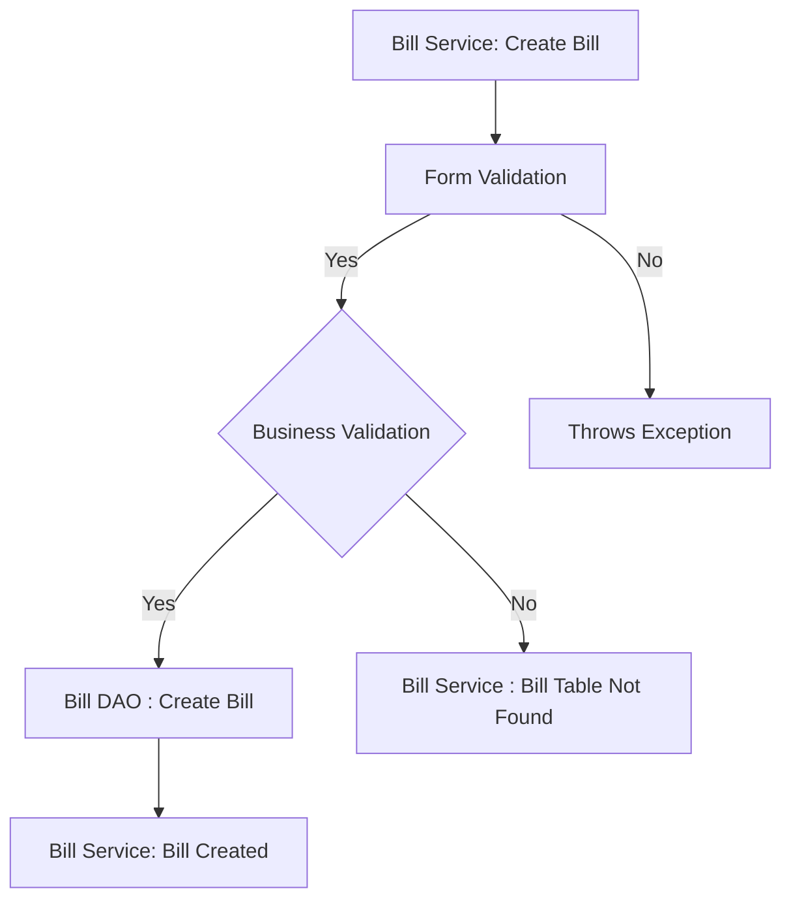
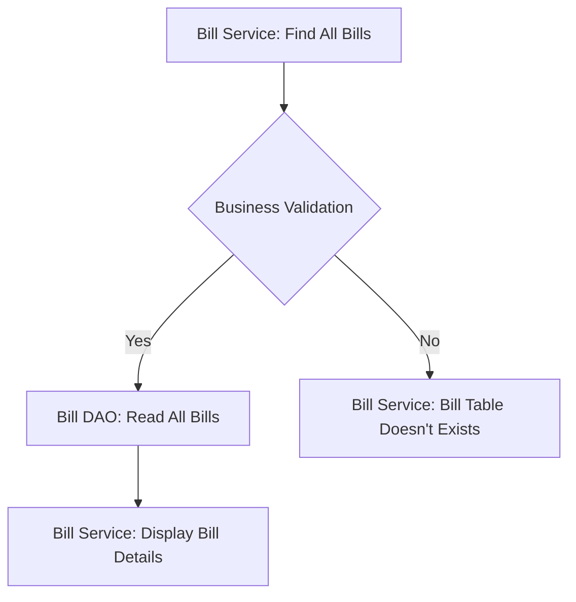
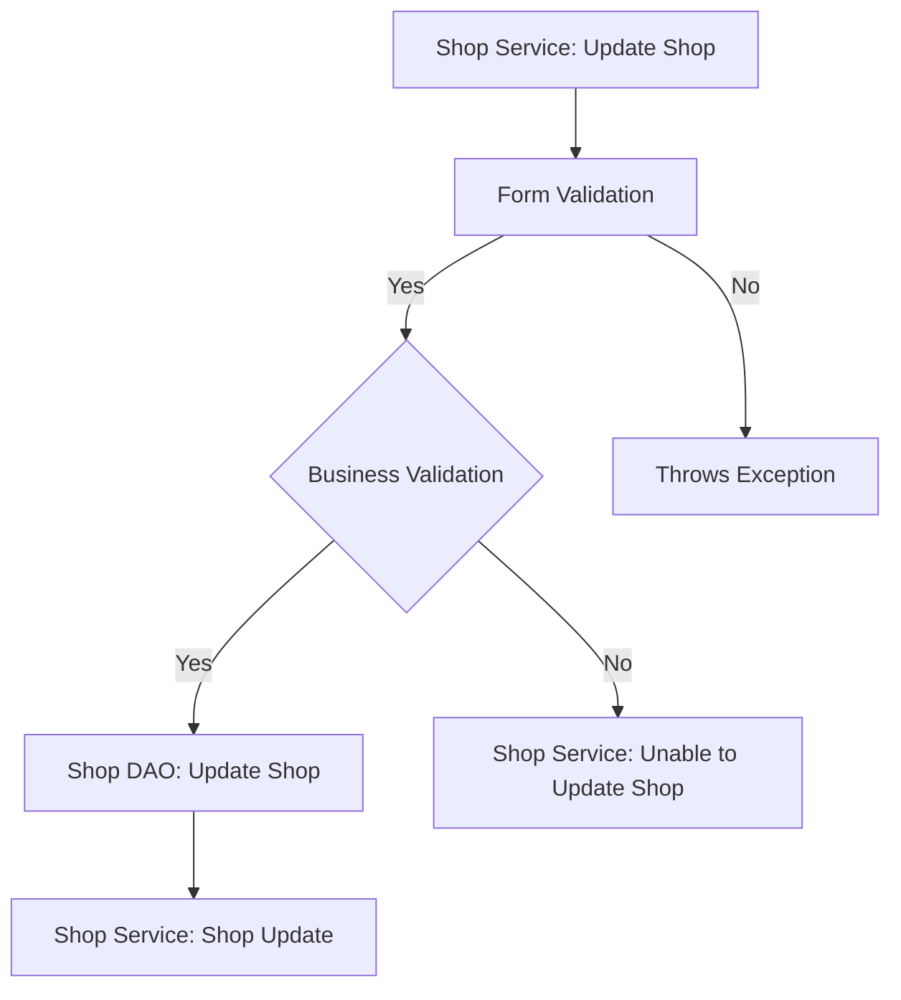
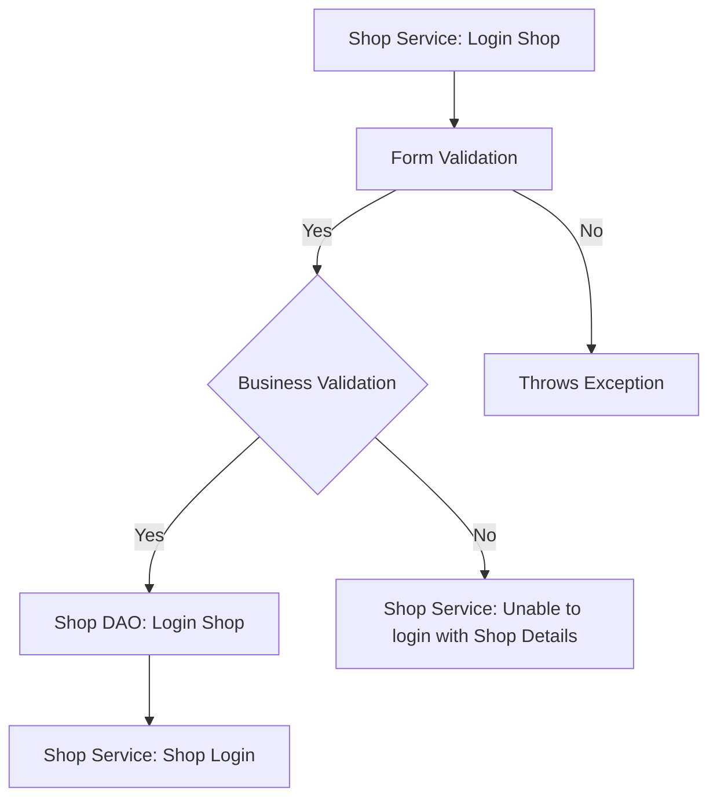

# M A M Billing  Checklist

 #### [Milestones](https://github.com/fssa-batch3/sec_b_maruthan.alagar__corejava_project_2/milestones)

## Database Design

- [ ] Create an ER diagram of the database

[](https://freeimage.host/i/HD02Net)

- [ ] Write Create table scripts [script](/src/main/resources/db/migration/V1__create_products.sql)


## Project Setup

- [ ] Create a new Java project
- [ ] Set up a MySQL database
- [ ] Add necessary libraries
	- [ ] JDBC, 
	- [ ] MySQL Connector, 
	- [ ] JUnit, 
	- [ ] Dotenv

## Module 1 : Product (Milestone 1)


### Feature 1: Product Creation 
#### User Story:
 User can create new product.
#### Prerequisites:
- [ ] Create Product table
- [ ] Implement Product model
- [ ] Implement Product DAO (create)
- [ ] Complete Price Module Feature 1.
#### Validations:

##### Form Validation:
- [ ] Product Name (Null , Pattern & Length)
- [ ] Quantity (Quantity <= 0)
- [ ] Quantity Type (ENUM - mg , ml , Nos)
- [ ] Special Name (Null , Pattern & Length) **(Optional)**
#####   Business Validation:
- [ ] Check The product is already exists or not using Name and Quantity.
#### Messages: 
 -  Name Cannot be Null or Empty.
 -  Quantity cannot be less than or equal to 0.
 -  Choose any Quantity Type.
 - Special Name Cannot be Null or Empty. 


#### Flow: 


### Feature 2 : List All Product
#### User Story:
 User can view the product list.
#### Prerequisites:
- [ ] Complete Product Module Feature 1.
- [ ] Implement Product DAO (Find All)

#### Validations:
#####   Business Validation:
- [ ] Check the Product table is already exists or not.
#### Messages: 
 -  Product Table Not Found.

#### Flow: 


### Feature 3 : Update Product Details
#### User Story:
 User can update product detail.
#### Prerequisites:
- [ ] Complete Product Module Feature 1.
- [ ] Implement Product DAO (Update)


#### Validations:

##### Form Validation:

- [ ]  Product Name (Null , Pattern & Length)
- [ ] Product ID ( ID <= 0)
- [ ] Quantity ( Quantity <= 0)
- [ ] Quantity Type (ENUM - mg , ml , Nos)
- [ ] Special Name (Null , Pattern & Length)
#####   Business Validation:
- [ ] Check The product is exists or not.
#### Messages: 
 -  Product is Not Found
 - Product ID cannot be less than or equal to 0
 -  Name cannot be Null or Empty.
 -  Quantity cannot be less than or equal to 0.
 -  Choose any Quantity Type.
 -  Special Name cannot be Null or Empty.


#### Flow: 


### Feature 4 : Delete Product Details
#### User Story:
User can delete a product.
#### Prerequisites:
- [ ] Complete Product Module Feature 1.
- [ ] Implement Product DAO (Delete)


#### Validations:

##### Form Validation:

- [ ] Product ID ( ID <= 0)
#####   Business Validation:
- [ ] Check The product is exists or not.
#### Messages: 
 -  Product Not Found
 -  Product ID cannot be less than or equal to 0


#### Flow: 


### Feature 5 : Product Details
#### User Story:
 User can view the single product details.
#### Prerequisites:
- [ ] Complete Product Module Feature 1.
- [ ] Implement Product DAO (Find By ID)


#### Validations:

##### Form Validation:

- [ ] Product ID ( ID <= 0)
#####   Business Validation:
- [ ] Check The product is exists or not.
#### Messages: 
 -  Product Not Found
 -  Product ID cannot be less than or equal to 0

#### Flow: 


## Module 2 : Price (Milestone 1)
### Feature 1: Price Creation 
#### User Story:
 User can create new Price.
#### Prerequisites:
- [ ] Create Price table
- [ ] Implement Price model
- [ ] Implement Price DAO (create)


#### Validations:

##### Form Validation:

- [ ] MRP (MRP <= 0)
- [ ] Tax (Tax <= 0 and Tax > 100)
- [ ]  Discount (Discount <= 0 and Discount > 100)

#####   Business Validation:
- [ ] Check the Price table is exists or not.
#### Messages: 
 -  MRP cannot be less than or equal to 0.
 -  Tax cannot be less than or equal to 0.
 -  Discount cannot be less than or equal to 0.
 -  Tax cannot be greater than 100.
 -  Discount cannot be greater than 100.

#### Flow: 


### Feature 2 : List All Price
#### User Story:
 User can view the Price list.
#### Prerequisites:
- [ ] Complete Price Module Feature 1.
- [ ] Implement Price DAO (Find All)
#### Validations:
#####   Business Validation:
- [ ] Check the Price table is already exists or not.
#### Messages: 
 -  Price Table Not Found.


#### Flow: 


### Feature 3 : Update Price Details
#### User Story:
 User can update Price.
#### Prerequisites:
- [ ] Complete Price Module Feature 1.
- [ ] Implement Price DAO (Update)

#### Validations:

##### Form Validation:

- [ ] Price ID (ID<= 0)
- [ ] MRP (MRP <= 0)
- [ ] Tax (Tax <= 0 and Tax > 100)
- [ ] Discount (Discount <= 0 and Discount > 100)

#####   Business Validation:
- [ ] Check The Price Detail is exists.
#### Messages: 
 -  Price ID is Invalid.
 -  MRP cannot be less than or equal to 0.
 -  Tax cannot be less than or equal to 0.
 -  Discount cannot be less than or equal to 0.
 -  Tax cannot be greater than 100.
 -  Discount cannot be greater than 100.


#### Flow: 


## Module: User (Milestone 2)


### Feature 1: User Creation 
#### User Story:
 Shop can create new User or Customer .
#### Prerequisites:
- [ ] Create User table
- [ ] Implement User model
- [ ] Implement User DAO (create)
#### Validations:

##### Form Validation:
- [ ] Name (Null , Pattern & Length)
- [ ] Phone Number ( Pattern )
- [ ] Email ( Null , Pattern)  **(Optional)**
- [ ] Address (Null , Empty , Length) **(Optional)**
#####   Business Validation:
- [ ] Check The user is already exists using phone number
#### Messages: 
 -  Name Cannot be Null or Empty.
 -  Phone Number doesn't match the Pattern.
 -  Email doesn't match the Pattern.
 -  Address Cannot be Empty. 


#### Flow: 


### Feature 2 : List All Users
#### User Story:
 User can view the Customer List.
#### Prerequisites:
- [ ] Complete User Module Feature 1.
- [ ] Implement User DAO (Find All)

#### Validations:
#####   Business Validation:
- [ ] Check the User table is already exists or not.
#### Messages: 
 -  User Table Not Found.

#### Flow: 


### Feature 3 : Update User Details
#### User Story:
 Shop can update User or Customer details.
#### Prerequisites:
- [ ] Complete User Module Feature 1.
- [ ] Implement User DAO (Update)
#### Validations:

##### Form Validation:
- [ ] Name (Null , Pattern & Length)
- [ ] Phone Number ( Pattern )
- [ ] Email ( Null , Pattern)  **(Optional)**
- [ ] Address (Null , Empty , Length) **(Optional)**
#####   Business Validation:
- [ ] Check the user is exists or not.

#### Messages: 
 -  Name Cannot be Null or Empty.
 -  Phone Number doesn't match the Pattern.
 -  Email doesn't match the Pattern.
 -  Address Cannot be Empty. 


#### Flow: 


### Feature 4 : Find User By Phone Number
#### User Story:
User can view the single User details.
#### Prerequisites:
- [ ] Complete User Module Feature 1.
- [ ] Implement User DAO (find by phone number)


#### Validations:

##### Form Validation:

- [ ] Phone Number ( Pattern )
#####   Business Validation:
- [ ] Check the User is exists or not.
#### Messages: 
 -  User Not Found
 -  Phone number doesn't  match the pattern.


#### Flow: 


## Module 2 : Bill (Milestone 2)
### Feature 1: Bill Creation 
#### User Story:
 User can create new Bill.
#### Prerequisites:
- [ ] Create Bill table
- [ ] Implement Bill model
- [ ] Implement Bill DAO (create)
- [ ] Complete Product Module Feature 1.
- [ ] Complete User Module Feature 1.
- [ ] Complete Bill Details Module Feature 1.


#### Validations:

##### Form Validation:

- [ ] User Id ( id<1 )
- [ ] Time Stamp
- [ ] Bill DTO ( null )

##### Business Validation:

- [ ] Check The Bill Table Exist or not.
#### Messages: 
 -  Invalid User ID.
 -  User doesn't exists.
 -  Invalid Bill Details.
 -  Bill Table Not Found

#### Flow: 



### Feature 2 : List All Bills
#### User Story:
 User can view the Bill List.
#### Prerequisites:
- [ ] Complete Bill Module Feature 1.
- [ ] Implement Bill DAO (Find All)

#### Validations:
#####   Business Validation:
- [ ] Check the Bill table is already exists or not.
#### Messages: 
 -  Bill Table Not Found.

#### Flow: 



### Feature 3 : Find bills by user phone number
#### User Story:
User can find bill details by using user phone number.
#### Prerequisites:
- [ ] Complete User Module Feature 1.
- [ ] Complete Bill Module Feature 1.
- [ ] Implement Bill DAO (find by phone number)


#### Validations:

##### Form Validation:
- [ ] Phone Number ( Pattern )
- [ ] Id ( id<1 )
#####   Business Validation:
- [ ] Check the User is exists or not.
- [ ] Check Bill Table exists or not.
#### Messages: 
 - Phone number doesn't  match the pattern.
 -  User Not Found
 -  Invalid User ID


#### Flow: 


### Feature 4 : Find All Recent Bills
#### User Story:
 User can View the recent Bills.
#### Prerequisites:
- [ ] Complete Bill Module Feature 1.
- [ ] Implement Bill DAO (Find All Recent Bills)

#### Validations:

#####   Business Validation:
- [ ] Check the Bill and Bill Details Table Exists or Not.
- [ ] Check the Time zone and Select Last 10 Minutes Bills
#### Messages: 
 - Bill table not Found.
 - Bill Details table not Found.
 - There is no Recents Bills.


#### Flow: 


## Module 3 : Bill Details (Milestone 2)
### Feature 1: Bill Details Creation 
#### User Story:
 User can create new Bill Details.
#### Prerequisites:
- [ ] Create Bill Details table
- [ ] Implement Bill DTO
- [ ] Implement  Bill Details DAO (create)
- [ ] Complete Bill Module Feature 1.


#### Validations:

##### Form Validation:

 - [ ] Bill ID (id < 1)
 
#####   Business Validation:
- [ ] Check the Bill table is exists or not.
- [ ] Check the Bill  Details table is exists or not.
#### Messages: 
 -  Invalid Bill ID.
 -  Bill table not found.
 - Bill details table not found.

#### Flow: 


## Module: Shop (Milestone 2)


### Feature 1: Shop Creation 
#### User Story:
create new shop via register .
#### Prerequisites:
- [ ] Create shop table
- [ ] Implement shop model
- [ ] Implement shop DAO (create)
#### Validations:

##### Form Validation:
- [ ] Shop Name (Null , Pattern & Length)
- [ ] License Number ( Pattern )
- [ ] GSTIN Number ( Pattern )
- [ ] Phone Number ( Pattern )
- [ ] Email ( Null , Pattern) 
- [ ] Address (Null , Empty , Length)
- [ ] Owner Name (Null , Empty , Length)
- [ ] Print Name (Null , Empty , Length , Pattern)
- [ ]  Password (Pattern)

#### Messages: 
 -  Invalid Shop Input 
 -  Shop Name Cannot be Null or Empty.
 -  Print Name Cannot be Null or Empty.
 -  Owner Name Cannot be Null or Empty.
 -  Shop Email Cannot be Null or Empty.
 -  Phone Number doesn't match the Pattern.
 -  Email doesn't match the Pattern.
 -  Password doesn't match the Pattern.
 -  Address Cannot be Empty. 


#### Flow: 


### Feature 2: Shop Update 
#### User Story:
 User Can Update shop details .
#### Prerequisites:
- [ ] Complete Shop Module 1 feature
- [ ] Implement shop DAO (update)
#### Validations:

##### Form Validation:
- [ ] Shop Name (Null , Pattern & Length)
- [ ] License Number ( Pattern )
- [ ] GSTIN Number ( Pattern )
- [ ] Phone Number ( Pattern )
- [ ] Email ( Null , Pattern) 
- [ ] Address (Null , Empty , Length)
- [ ] Owner Name (Null , Empty , Length)
- [ ] Print Name (Null , Empty , Length , Pattern)

#### Messages: 
 -  Invalid Shop Input 
 -  Shop Name Cannot be Null or Empty.
 -  Print Name Cannot be Null or Empty.
 -  Owner Name Cannot be Null or Empty.
 -  Shop Email Cannot be Null or Empty.
 -  Phone Number doesn't match the Pattern.
 -  Email doesn't match the Pattern.
 -  Address Cannot be Empty. 


#### Flow: 


### Feature 3: Shop Login 
#### User Story:
 User Can Login with shop details .
#### Prerequisites:
- [ ] Complete Shop Module 1 feature
- [ ] Implement shop DAO (Login)
#### Validations:

##### Form Validation:

- [ ] Email ( Null , Pattern) 
- [ ] Password (Pattern)
##### Business Validation:
- [ ] Check Email and Password are correct.
#### Messages: 
 -  Invalid Credentials 
 -  Shop Email Cannot be Null or Empty.
 -  Email doesn't match the Pattern.
 -  Password doesn't match the Pattern.
 -  Password Cannot be Empty. 


#### Flow: 


### Feature 4: Update Shop Password 
#### User Story:
 User Can Update shop Password .
#### Prerequisites:
- [ ] Complete Shop Module 1 feature
- [ ] Implement shop DAO (Change Password)
#### Validations:

##### Form Validation:

- [ ] Email ( Null , Pattern) 
- [ ] Password (Pattern)
##### Form Validation:
- [ ] Check Email and Password are correct.
#### Messages: 
 -  Invalid Credentials 
 -  Shop Email Cannot be Null or Empty.
 -  Email doesn't match the Pattern.
 -  Password doesn't match the Pattern.
 -  Password Cannot be Empty. 


#### Flow: 

```mermaid
graph  TD;

A[Shop Service: Update Shop Password]  -->  B[Form Validation]

B  -- Yes -->  C{Business Validation}
B -- No --> G[Throws Exception]

C  -- Yes -->  D[Shop DAO: Update Shop Password]

D  -->  E[Shop Service: Update Shop Password ]

C  -- No -->  F[Shop Service: Unable to Change Shop Password ]
```

